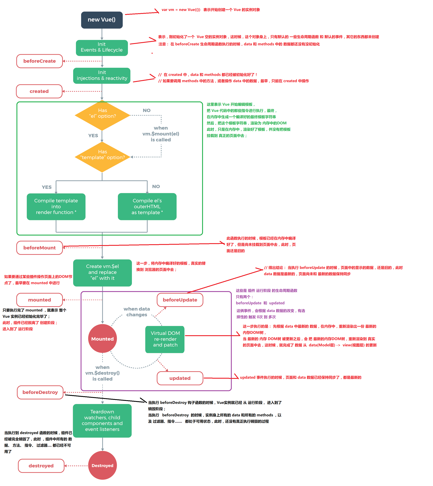

# Vue.js
## Vue的基本指令
### Vue之 - `基本的代码结构`和`插值表达式`、`v-cloak`
使用 v-cloak 能够解决 插值表达式闪烁的问题
```html
<p v-cloak>++++++++ {{ msg }} ----------</p>
```
### Vue指令之`v-text`和`v-html`
`v-text`:
```html
<h4 v-text="msg">==================</h4>
<!-- 默认 v-text 是没有闪烁问题的 -->
<!-- v-text会覆盖元素中原本的内容，但是 插值表达式  只会替换自己的这个占位符，不会把 整个元素的内容清空 -->
```
`v-html`:
```html
<div v-html="msg2">1212112</div>
<!-- msg2: '<h1>哈哈，我是一个大大的H1， 我大，我骄傲</h1>' -->
<!-- 可以辨识html标记 -->
```
### Vue指令之`v-bind`的三种用法
+ 直接使用指令`v-bind`
+ 使用简化指令`:`
+ 在绑定的时候，拼接绑定内容：`:title="btnTitle + ', 这是追加的内容'"`
__注意： v-bind: 指令可以被简写为 :要绑定的属性__
__v-bind 中，可以写合法的JS表达式__

### `v-on`
Vue 中提供了 `v-on`: 事件绑定机制

在Vue中，使用事件绑定机制，为元素指定处理函数的时候，如果加了小括号，就可以给函数传参了

```html
<input type="button" value="添加" class="btn btn-primary" @click="add()">
```
#### 事件修饰符
`.stop`
```html
<!-- 使用  .stop  阻止冒泡 -->
<!-- <div class="inner" @click="div1Handler">
<input type="button" value="戳他" @click.stop="btnHandler">

<td>
<a href="" @click.prevent="del(item.id)">删除</a>
</td>
</div> -->
```

`.prevent`
```html
<!-- 使用 .prevent 阻止默认行为 -->
<!-- <a href="http://www.baidu.com" @click.prevent="linkClick">有问题，先去百度</a> -->
```

`.capture`
```html
<!-- 使用  .capture 实现捕获触发事件的机制 -->
<!-- <div class="inner" @click.capture="div1Handler">
<input type="button" value="戳他" @click="btnHandler">
</div> -->
```

`.self`
```html
<!-- 使用 .self 实现只有点击当前元素时候，才会触发事件处理函数 -->
<!-- <div class="inner" @click="div1Handler">
<input type="button" value="戳他" @click="btnHandler">
</div> -->
```

`.once`
```html
<!-- 使用 .once 只触发一次事件处理函数 -->
<!-- <a href="http://www.baidu.com" @click.prevent.once="linkClick">有问题，先去百度</a> -->

```

`.stop`和`.self`的区别
__.self 只会阻止自己身上冒泡行为的触发，并不会真正阻止 冒泡的行为__

### `v-model`指令
`v-bind` 只能实现数据的单向绑定，从 M 自动绑定到 V， 无法实现数据的双向绑定

使用  `v-model` 指令，可以实现 **表单元素**和 Model 中数据的双向数据绑定

*注意： v-model 只能运用在 表单元素中*

### `v-for`循环普通数组，对象数组...
循环普通数组
```html
<div id="app">
<p v-for="(item, i) in list">索引值：{{i}} --- 每一项：{{item}}</p>

</div>
```

```javascript
// 创建 Vue 实例，得到 ViewModel
var vm = new Vue({
  el: '#app',
  data: {
    list: [1, 2, 3, 4, 5, 6]
  },
  methods: {}
});
```

循环对象数组
```html
<div id="app">
<p v-for="(user, i) in list">Id：{{ user.id }} --- 名字：{{ user.name }} --- 索引：{{i}}</p>
</div>
```

```javascript
// 创建 Vue 实例，得到 ViewModel
var vm = new Vue({
  el: '#app',
  data: {
    list: [
    { id: 1, name: 'zs1' },
    { id: 2, name: 'zs2' },
    { id: 3, name: 'zs3' },
    { id: 4, name: 'zs4' }
    ]
  },
  methods: {}
});
```

循环对象
```html
<div id="app">
<!-- 注意：在遍历对象身上的键值对的时候， 除了 有  val  key  ,在第三个位置还有 一个 索引  -->
<p v-for="(val, key, i) in user">值是： {{ val }} --- 键是： {{key}} -- 索引： {{i}}</p>
</div>
```
```javascript
// 创建 Vue 实例，得到 ViewModel
var vm = new Vue({
  el: '#app',
  data: {
    user: {
      id: 1,
      name: '托尼·屎大颗',
      gender: '男'
    }
  },
  methods: {}
});
```

迭代数字
```html
<div id="app">
<!-- in 后面我们放过  普通数组，对象数组，对象， 还可以放数字 -->
<!-- 注意：如果使用 v-for 迭代数字的话，前面的 count 值从 1 开始 -->
<p v-for="count in 10">这是第 {{ count }} 次循环</p>
</div>
```

```javascript
// 创建 Vue 实例，得到 ViewModel
var vm = new Vue({
  el: '#app',
  data: {},
  methods: {}
});
```

key的使用
```html
<div id="app">

<div>
<label>Id:
<input type="text" v-model="id">
</label>

<label>Name:
<input type="text" v-model="name">
</label>

<input type="button" value="添加" @click="add">
</div>
=======
在组件中，使用v-for循环的时候，或者在一些特殊情况中，如果 v-for 有问题，必须 在使用 v-for 的同时，指定 唯一的 字符串/数字 类型 :key 值 

注意： key 在使用的时候，必须使用 v-bind 属性绑定的形式，指定 key 的值

注意： v-for 循环的时候，key 属性只能使用 number获取string
=======
-->
<p v-for="item in list" :key="item.id">
<input type="checkbox">{{item.id}} --- {{item.name}}
</p>
</div>
```

```javascript
// 创建 Vue 实例，得到 ViewModel
var vm = new Vue({
  el: '#app',
  data: {
    id: '',
    name: '',
    list: [
    { id: 1, name: '李斯' },
    { id: 2, name: '嬴政' },
    { id: 3, name: '赵高' },
    { id: 4, name: '韩非' },
    { id: 5, name: '荀子' }
    ]
  },
  methods: {
        add() { // 添加方法
          this.list.unshift({ id: this.id, name: this.name })
        }
      }
});
```


### `v-if`和`v-show`
```html
    <div id="app">

    <!-- <input type="button" value="toggle" @click="toggle"> -->
    <input type="button" value="toggle" @click="flag=!flag">
=====================
    <!-- 
=====================
    v-if 的特点：每次都会重新删除或创建元素 -->
    <!-- v-show 的特点： 每次不会重新进行DOM的删除和创建操作，只是切换了元素的 display:none 样式 
=====================
    -->
    <!-- v-if 有较高的切换性能消耗 -->
    <!-- v-show 有较高的初始渲染消耗 -->

    <!-- 如果元素涉及到频繁的切换，最好不要使用 v-if, 而是推荐使用 v-show -->
    <!-- 如果元素可能永远也不会被显示出来被用户看到，则推荐使用 v-if -->
    <h3 v-if="flag">这是用v-if控制的元素</h3>
    <h3 v-show="flag">这是用v-show控制的元素</h3>

  </div>
```

```javascript
  // 创建 Vue 实例，得到 ViewModel
  var vm = new Vue({
    el: '#app',
    data: {
      flag: false
    },
    methods: {
/* toggle() {
this.flag = !this.flag
} */
}
});
```
### 总结

```html
<!-- 3. 插值表达式   v-cloak   v-text   v-html   v-bind（缩写是:）   v-on（缩写是@）   v-model   v-for   v-if     v-show -->

<!-- 4. 事件修饰符  ：  .stop   .prevent   .capture   .self     .once -->

<!-- 5. el  指定要控制的区域    data 是个对象，指定了控制的区域内要用到的数据    methods 虽然带个s后缀，但是是个对象，这里可以自定义了方法 -->

<!-- 6. 在 VM 实例中，如果要访问 data 上的数据，或者要访问 methods 中的方法， 必须带 this -->

<!-- 7. 在 v-for 要会使用 key 属性 （只接受 string / number） -->

<!-- 8. v-model 只能应用于表单元素 -->

<!-- 9. 在vue中绑定样式两种方式  v-bind:class   v-bind:style -->
```

## Vue的初始化
```javascript
// 创建 Vue 实例，得到 ViewModel
var vm = new Vue({
  el: '#app',
  data: {
    styleObj1: { color: 'red', 'font-weight': 200 },
    styleObj2: { 'font-style': 'italic' }
    },
    methods: {}
    });
```

## Vue的this
    *注意：在 VM实例中，如果想要获取 data 上的数据，或者 想要调用 methods 中的 方法，必须通过 this.数据属性名  或  this.方法名 来进行访问，这里的this，就表示 我们 new 出来的  VM 实例对象*

    **注意： VM实例，会监听自己身上 data 中所有数据的改变，只要数据一发生变化，就会自动把 最新的数据，从data 上同步到页面中去；【好处：程序员只需要关心数据，不需要考虑如何重新渲染DOM页面】**


## Vue中的样式
```html
<div id="app">
<!-- <h1 class="red thin">这是一个很大很大的H1，大到你无法想象！！！</h1> -->

<!-- 第一种使用方式，直接传递一个数组，
=======  
注意： 这里的 class 需要使用  v-bind 做数据绑定 
=======  
-->
<!-- <h1 :class="['thin', 'italic']">这是一个很大很大的H1，大到你无法想象！！！</h1> -->

<!-- 在数组中使用三元表达式 -->
<!-- <h1 :class="['thin', 'italic', flag?'active':'']">这是一个很大很大的H1，大到你无法想象！！！</h1> -->

<!-- 在数组中使用 对象来代替三元表达式，提高代码的可读性 -->
<!-- <h1 :class="['thin', 'italic', {'active':flag} ]">这是一个很大很大的H1，大到你无法想象！！！</h1> -->

<!-- 
=======
在为 class 使用 v-bind 绑定 对象的时候，对象的属性是类名，由于 对象的属性可带引号，也可不带引号，所以 这里我没写引号；  属性的值 是一个标识符 
=======
-->
<h1 :class="classObj">这是一个很大很大的H1，大到你无法想象！！！</h1>


</div>
```

## Vue的过滤器
定义一个 Vue 全局的过滤器，名字叫做  msgFormat
该函数的第一个参数就是this.data的数据也就是要进行过滤的数据
```javascript
Vue.filter('msgFormat', function (msg, arg, arg2) {
      // 字符串的  replace 方法，第一个参数，除了可写一个 字符串之外，还可以定义一个正则
      return msg.replace(/单纯/g, arg + arg2)
    })

    // 创建 Vue 实例，得到 ViewModel
    var vm = new Vue({
      el: '#app',
      data: {
        msg: '曾经，我也是一个单纯的少年，单纯的我，傻傻的问，谁是世界上最单纯的男人'
      },
      methods: {}
    });
```
使用过滤器
```html
<div id="app">
<p>{{ msg | msgFormat('疯狂+1', '123') | test }}</p>
</div>
```


## Vue定义全局按键修饰符

## 自定义Vue的指令

## Vue的生命周期



## vue-resource
引入文件
```javascript
<script src="./lib/vue-2.4.0.js"></script>
// 注意：vue-resource 依赖于 Vue，所以先后顺序要注意  
// this.$http.jsonp 
<script src="./lib/vue-resource-1.3.4.js"></script>
```

配置路由
```javascript
// 创建 Vue 实例，得到 ViewModel
var vm = new Vue({
  el: '#app',
  data: {},
  methods: {
        //=====================
        // 发起get请求
        //=====================
        getInfo() {
          //  当发起get请求之后， 通过 .then 来设置成功的回调函数
          this.$http.get('http://vue.studyit.io/api/getlunbo').then(function (result) {
            // 通过 result.body 拿到服务器返回的成功的数据
            // console.log(result.body)
          })
        },
        //=====================
        // 发起post请求
        //=====================
        postInfo() { // 发起 post 请求   application/x-wwww-form-urlencoded
          //  手动发起的 Post 请求，默认没有表单格式，所以，有的服务器处理不了
          //  通过 post 方法的第三个参数， { emulateJSON: true } 设置 提交的内容类型 为 普通表单数据格式
          this.$http.post('http://vue.studyit.io/api/post', {}, { emulateJSON: true }).then(result => {
            console.log(result.body)
          })
        },
        //=====================
        // 发起JSONP请求
        //=====================
        jsonpInfo() { // 发起JSONP 请求
          this.$http.jsonp('http://vue.studyit.io/api/jsonp').then(result => {
            console.log(result.body)
          })
        }
      }
    });
```

## Vue的动画

### vue的过渡类名实现动画
需求： 点击按钮，让 h3 显示，再点击，让 h3 隐藏

1. 使用 transition 元素，把 需要被动画控制的元素，包裹起来

__transition 元素，是 Vue 官方提供的__
```html
<div id="app">
<input type="button" value="toggle" @click="flag=!flag">
<transition>
<h3 v-if="flag">这是一个H3</h3>
</transition>
</div>
```
```javascript
// 创建 Vue 实例，得到 ViewModel
var vm = new Vue({
  el: '#app',
  data: {
    flag: false
  },
  methods: {}
});
```

2. 自定义两组样式，来控制 transition 内部的元素实现动画

```html
<style>
/* v-enter 【这是一个时间点】 是进入之前，元素的起始状态，此时还没有开始进入 */
/* v-leave-to 【这是一个时间点】 是动画离开之后，离开的终止状态，此时，元素 动画已经结束了 */
.v-enter,
.v-leave-to {
  opacity: 0;
  transform: translateX(150px);
}

/* v-enter-active 【入场动画的时间段】 */
/* v-leave-active 【离场动画的时间段】 */
.v-enter-active,
.v-leave-active{
  transition: all 0.8s ease;
}
</style>
```

### 动画修改v-前缀
使用`transition`的`name`属性定义要使用的那个过渡动画

```html
<div id="app">
<input type="button" value="toggle2" @click="flag2=!flag2">
<transition name="my">
<h6 v-if="flag2">这是一个H6</h6>
</transition>
</div>
```

```html
<style>
.my-enter,
.my-leave-to {
  opacity: 0;
  transform: translateY(70px);
}

.my-enter-active,
.my-leave-active{
  transition: all 0.8s ease;
}
</style>
```

```javascript
// 创建 Vue 实例，得到 ViewModel
var vm = new Vue({
  el: '#app',
  data: {
    flag: false,
    flag2: false
  },
  methods: {}
});
```

### 使用第三方类名实现动画

### 使用钩子函数实现半场动画
使用动画的生命周期实现

```html
<div id="app">
<input type="button" value="快到碗里来" @click="flag=!flag">
<!-- 1. 使用 transition 元素把 小球包裹起来 -->
<transition
@before-enter="beforeEnter"     <!-- 为动画的生命周期绑定事件 -->
@enter="enter"
@after-enter="afterEnter">
<div class="ball" v-show="flag"></div>
</transition>
</div>
```
小球的样式
```html
<style>
.ball {
  width: 15px;
  height: 15px;
  border-radius: 50%;
  background-color: red;
}
</style>
```

```javascript
// 创建 Vue 实例，得到 ViewModel
var vm = new Vue({
  el: '#app',
  data: {
    flag: false
  },
  methods: {
        // 注意： 动画钩子函数的第一个参数：el，表示 要执行动画的那个DOM元素，是个原生的 JS DOM对象
        // 大家可以认为 ， el 是通过 document.getElementById('') 方式获取到的原生JS DOM对象
        // 
      
        beforeEnter(el){
          // beforeEnter 表示动画入场之前，此时，动画尚未开始，可以 在 beforeEnter 中，设置元素开始动画之前的起始样式
          // 设置小球开始动画之前的，起始位置
          el.style.transform = "translate(0, 0)"
        },

        enter(el, done){
          // 这句话，没有实际的作用，但是，如果不写，出不来动画效果；
          // 可以认为 el.offsetWidth 会强制动画刷新
          el.offsetWidth
          // enter 表示动画 开始之后的样式，这里，可以设置小球完成动画之后的，结束状态
          el.style.transform = "translate(150px, 450px)"
          el.style.transition = 'all 1s ease'

          // 这里的 done， 起始就是 afterEnter 这个函数，也就是说：done 是 afterEnter 函数的引用
          done()
        },

        afterEnter(el){
          // 动画完成之后，会调用 afterEnter
          // console.log('ok')
          this.flag = !this.flag
        }
      }
    });
```
### transitionGroup
在实现列表过渡的时候，如果需要过渡的元素，是通过 v-for 循环渲染出来的，不能使用 transition 包裹，需要使用 transitionGroup

如果要为 v-for 循环创建的元素设置动画，必须为每一个 元素 设置 :key 属性

给 transition-group 添加 appear 属性，实现页面刚展示出来时候，入场时候的效果

通过 为 transition-group 元素，设置 tag 属性，指定 transition-group 渲染为指定的元素，如果不指定 tag 属性，默认，渲染为 span 标签

```html
<transition-group appear tag="ul">
<li v-for="(item, i) in list" :key="item.id" @click="del(i)">
{{item.id}} --- {{item.name}}
</li>
</transition-group>
```
```javascript
// 创建 Vue 实例，得到 ViewModel
var vm = new Vue({
  el: '#app',
  data: {
    id: '',
    name: '',
    list: [
    { id: 1, name: '赵高' },
    { id: 2, name: '秦桧' },
    { id: 3, name: '严嵩' },
    { id: 4, name: '魏忠贤' }
    ]
  },
  methods: {
    add() {
      this.list.push({ id: this.id, name: this.name })
      this.id = this.name = ''
    },
    del(i) {
      this.list.splice(i, 1)
    }
  }
});
```

## Vue的组件
### 创建组件的方式1
1.1 使用 Vue.extend 来创建全局的Vue组件
```javascript
var com1 = Vue.extend({
    //   template: '<h3>这是使用 Vue.extend 创建的组件</h3>' // 通过 template 属性，指定了组件要展示的HTML结构
    // })
```
1.2 使用 Vue.component('组件的名称', 创建出来的组件模板对象)
如果使用 Vue.component 定义全局组件的时候，组件名称使用了 驼峰命名，则在引用组件的时候，需要把大写的驼峰改为小写的字母，同时，两个单词之前，使用 - 链接；

如果不使用驼峰,则直接拿名称来使用即可;
```javascript
Vue.component('mycom1', com1)
```
```javascrip
// 创建 Vue 实例，得到 ViewModel
var vm = new Vue({
  el: '#app',
  data: {},
  methods: {}
  });
```
### Vue.component 
第一个参数:组件的名称,将来在引用组件的时候,就是一个 标签形式 来引入 它的
第二个参数: Vue.extend 创建的组件  ,其中 template 就是组件将来要展示的HTML内容

```javascript
Vue.component('mycom1', Vue.extend({
  template: '<h3>这是使用 Vue.extend 创建的组件</h3>'
}))
```
### 创建组件的方式2

```html
<div id="app">
<!-- 还是使用 标签形式,引入自己的组件 -->
<mycom2></mycom2>
</div>
```

```javascript
// 注意:不论是哪种方式创建出来的组件,组件的 template 属性指向的模板内容,****必须有且只能有唯一的一个根元素***
Vue.component('mycom2', {
  template: '<div><h3>这是直接使用 Vue.component 创建出来的组件</h3><span>123</span></div>'
})

    // 创建 Vue 实例，得到 ViewModel
    var vm = new Vue({
      el: '#app',
      data: {},
      methods: {}
    });
```

### 创建组件的方式3
```html
<!-- 在 被控制的 #app 外面,使用 template 元素,定义组件的HTML模板结构  -->
<template id="tmpl">
<div>
<h1>这是通过 template 元素,在外部定义的组件结构,这个方式,有代码的只能提示和高亮</h1>
<h4>好用,不错!</h4>
</div>
</template>

<template id="tmpl2">
<h1>这是私有的 login 组件</h1>
</template>
```

```javascript
定义全局组件
Vue.component('mycom3', {
      template: '#tmpl'
    })

// 创建 Vue 实例，得到 ViewModel
    var vm = new Vue({
      el: '#app',
      data: {},
      methods: {}
    });

// 第二个Vue实例，定义私有组件
    var vm2 = new Vue({
      el: '#app2',
      data: {},
      methods: {},
      filters: {},
      directives: {},
      components: { // 定义实例内部私有组件的
        login: {
          template: '#tmpl2'
        }
      },

      beforeCreate() { },
      created() { },
      beforeMount() { },
      mounted() { },
      beforeUpdate() { },
      updated() { },
      beforeDestroy() { },
      destroyed() { }
    })
```
使用
```html
<div id="app">
<mycom3></mycom3>
<!-- <login></login> -->
</div>


<div id="app2">
<mycom3></mycom3>
<login></login>
</div>
```

### 组件中的data和methods
1. 组件可以有自己的 data 数据
2. 组件的 data 和 实例的 data 有点不一样,实例中的 data 可以为一个对象,但是 组件中的 data 必须是一个方法
3. 组件中的 data 除了必须为一个方法之外,这个方法内部,还必须返回一个对象才行;
4. 组件中 的data 数据,使用方式,和实例中的 data 使用方式完全一样!!!

```javascript
Vue.component('mycom1', {
  template: '<h1>这是全局组件 --- {{msg}}</h1>',
  data: function () {
    return {
      msg: '这是组件的中data定义的数据'
    }
  }
})

// 创建 Vue 实例，得到 ViewModel
    var vm = new Vue({
      el: '#app',
      data: {},
      methods: {}
    });
```
使用
```html
<div id="app">
<mycom1></mycom1>
</div>
```

### 组件的切换方式1
```javascript
Vue.component('login', {
  template: '<h3>登录组件</h3>'
})

Vue.component('register', {
  template: '<h3>注册组件</h3>'
})

// 创建 Vue 实例，得到 ViewModel
var vm = new Vue({
  el: '#app',
  data: {
    flag: false
  },
  methods: {}
});
```
使用
```html
<div id="app">
<a href="" @click.prevent="flag=true">登录</a>
<a href="" @click.prevent="flag=false">注册</a>

<login v-if="flag"></login>
<register v-else="flag"></register>

</div>
```

### 组件的切换方式2
Vue提供了 component ,来展示对应名称的组件

component 是一个占位符, :is 属性,可以用来指定要展示的组件的名称

```javascript
// 组件名称是 字符串
Vue.component('login', {
  template: '<h3>登录组件</h3>'
})

Vue.component('register', {
  template: '<h3>注册组件</h3>'
})

    // 创建 Vue 实例，得到 ViewModel
    var vm = new Vue({
      el: '#app',
      data: {
        comName: 'login' // 当前 component 中的 :is 绑定的组件的名称
      },
      methods: {}
    });
```
使用
```html
<div id="app">
    <a href="" @click.prevent="comName='login'">登录</a>
    <a href="" @click.prevent="comName='register'">注册</a>

    <component :is="comName"></component>
  </div>
```

### 组件切换的方式
通过 mode 属性,设置组件切换时候的 模式

```html
<div id="app">
<a href="" @click.prevent="comName='login'">登录</a>
<a href="" @click.prevent="comName='register'">注册</a>

<!-- 通过 mode 属性,设置组件切换时候的 模式 -->
<transition mode="out-in">
<component :is="comName"></component>
</transition>

</div>
```

```javascript
// 组件名称是 字符串
Vue.component('login', {
  template: '<h3>登录组件</h3>'
})

Vue.component('register', {
  template: '<h3>注册组件</h3>'
})

    // 创建 Vue 实例，得到 ViewModel
    var vm = new Vue({
      el: '#app',
      data: {
        comName: 'login' // 当前 component 中的 :is 绑定的组件的名称
      },
      methods: {}
    });
```

### 父组件向自组件传值

`props`  `v-bind`

父组件，可以在引用子组件的时候， 通过 属性绑定（v-bind:） 的形式, 把 需要传递给 子组件的数据，以*属性*绑定的形式，传递到子组件内部，供子组件使用

```javascript
// 创建 Vue 实例，得到 ViewModel
var vm = new Vue({
  el: '#app',
  data: {
    msg: '123 啊-父组件中的数据'
  },
  methods: {},

  components: {
        // 结论：经过演示，发现，子组件中，默认无法访问到 父组件中的 data 上的数据 和 methods 中的方法
      
        com1: {
          data() { 

          // 注意： 子组件中的 data 数据，并不是通过 父组件传递过来的，而是子组件自身私有的，比如： 子组件通过 Ajax ，请求回来的数据，都可以放到 data 身上；
          
          // data 上的数据，都是可读可写的；
            return {
              title: '123',
              content: 'qqq'
            }
          },

          template: '<h1 @click="change">这是子组件 --- {{ parentmsg }}</h1>',

          // 注意： 组件中的 所有 props 中的数据，都是通过 父组件传递给子组件的
          // props 中的数据，都是只读的，无法重新赋值
        
          props: ['parentmsg'], 

          // 把父组件传递过来的 parentmsg 属性，先在 props 数组中，定义一下，这样，才能使用这个数据
          directives: {},
          filters: {},
          components: {},
          methods: {
            change() {
              this.parentmsg = '被修改了'
            }
          }
        }
      }
    });
```

使用
```html
<div id="app">
<!-- 父组件，可以在引用子组件的时候， 通过 属性绑定（v-bind:） 的形式, 把 需要传递给 子组件的数据，以属性绑定的形式，传递到子组件内部，供子组件使用 -->
<com1 v-bind:parentmsg="msg"></com1>
</div>
```

### 父组件把方法传递给子组件
父组件向子组件 传递 方法，使用的是 事件绑定机制； v-on, 当我们自定义了 一个 事件属性之后，那么，子组件就能够，通过某些方式，来调用 传递进去的 这个 方法了

```javascript
// 定义了一个字面量类型的 组件模板对象
    var com2 = {
      template: '#tmpl', // 通过指定了一个 Id, 表示 说，要去加载 这个指定Id的 template 元素中的内容，当作 组件的HTML结构
      data() {
        return {
          sonmsg: { name: '小头儿子', age: 6 }
        }
      },
      methods: {
        myclick() {
          // 当点击子组件的按钮的时候，如何 拿到 父组件传递过来的 func 方法，并调用这个方法？？？
          //  emit 英文原意： 是触发，调用、发射的意思
          // this.$emit('func123', 123, 456)
          this.$emit('func', this.sonmsg)
        }
      }
    }


    // 创建 Vue 实例，得到 ViewModel
    var vm = new Vue({
      el: '#app',
      data: {
        datamsgFormSon: null
      },
      methods: {
        show(data) {
          // console.log('调用了父组件身上的 show 方法: --- ' + data)
          // console.log(data);
          this.datamsgFormSon = data
        }
      },

      components: {
        com2
        // com2: com2
      }
    });
```

使用
```html
<div id="app">
<!-- 父组件向子组件 传递 方法，使用的是 事件绑定机制； v-on, 当我们自定义了 一个 事件属性之后，那么，子组件就能够，通过某些方式，来调用 传递进去的 这个 方法了 -->
<com2 @func="show"></com2>
</div>

<template id="tmpl">
<div>
<h1>这是 子组件</h1>
<input type="button" value="这是子组件中的按钮 - 点击它，触发 父组件传递过来的 func 方法" @click="myclick">
</div>
</template>
```
## Vue的ref

## Vue的路由
1. 安装 vue-router 路由模块
```html
<script src="./lib/vue-router-3.0.1.js"></script>
<script src="./lib/vue-router-3.0.1.js"></script>
```
路由有一个样式可以定义
```html
<style>
.router-link-active,
.myactive {
  color: red;
  font-weight: 800;
  font-style: italic;
  font-size: 80px;
  text-decoration: underline;
  background-color: green;
}

.v-enter,
.v-leave-to {
  opacity: 0;
  transform: translateX(140px);
}

.v-enter-active,
.v-leave-active {
  transition: all 0.5s ease;
}
</style>
```

使用`router-link`标签
router-link 默认渲染为一个a 标签
使用`tag`修改默认渲染的标签
```html
<router-link to="/login" tag="span">登录</router-link>
<router-link to="/register">注册</router-link>
```
`router-view`
这是 vue-router 提供的元素，专门用来 当作占位符的，将来，路由规则，匹配到的组件，就会展示到这个 router-view 中去

所以： 我们可以把 router-view 认为是一个占位符 

```html
<transition mode="out-in">
<router-view></router-view>
</transition>
```

```javascript
// 组件的模板对象
    var login = {
      template: '<h1>登录组件</h1>'
    }

    var register = {
      template: '<h1>注册组件</h1>'
    }


    /*  Vue.component('login', {
       template: '<h1>登录组件</h1>'
     }) */

    // 2. 创建一个路由对象， 当 导入 vue-router 包之后，在 window 全局对象中，就有了一个 路由的构造函数，叫做 VueRouter
    // 在 new 路由对象的时候，可以为 构造函数，传递一个配置对象
    
    var routerObj = new VueRouter({
      // route // 这个配置对象中的 route 表示 【路由匹配规则】 的意思
      routes: [ // 路由匹配规则 
        // 每个路由规则，都是一个对象，这个规则对象，身上，有两个必须的属性：
        //  属性1 是 path， 表示监听 哪个路由链接地址；
        //  属性2 是 component， 表示，如果 路由是前面匹配到的 path ，则展示 component 属性对应的那个组件
        // 注意： component 的属性值，必须是一个 组件的模板对象， 不能是 组件的引用名称；
        // { path: '/', component: login },
        { path: '/', redirect: '/login' }, // 这里的 redirect 和 Node 中的 redirect 完全是两码事
        { path: '/login', component: login },
        { path: '/register', component: register }
      ],
      linkActiveClass: 'myactive'
    })

    // 创建 Vue 实例，得到 ViewModel
    var vm = new Vue({
      el: '#app',
      data: {},
      methods: {},
      router: routerObj // 将路由规则对象，注册到 vm 实例上，用来监听 URL 地址的变化，然后展示对应的组件
    });
```

### 路由规则中定义参数
```html
<div id="app">

<!-- 如果在路由中，使用 查询字符串，给路由传递参数，则 不需要修改 路由规则的 path 属性 -->
<router-link to="/login?id=10&name=zs">登录</router-link>
<router-link to="/register">注册</router-link>

<router-view></router-view>

</div>
```

```javascript
var login = {
      template: '<h1>登录 --- {{ $route.query.id }} --- {{ $route.query.name }}</h1>',
      data(){
        return {
          msg: '123'
        }
      },
      created(){ // 组件的生命周期钩子函数
        // console.log(this.$route)
        // console.log(this.$route.query.id)
      }
    }

    var register = {
      template: '<h1>注册</h1>'
    }

    var router = new VueRouter({
      routes: [
        { path: '/login', component: login },
        { path: '/register', component: register }
      ]
    })

    // 创建 Vue 实例，得到 ViewModel
    var vm = new Vue({
      el: '#app',
      data: {},
      methods: {},
      // router: router
      router
    });
```

路由规则传参方式2

```html
<div id="app">

<!-- 如果在路由中，使用 查询字符串，给路由传递参数，则 不需要修改 路由规则的 path 属性 -->
<router-link to="/login/12/ls">登录</router-link>
<router-link to="/register">注册</router-link>

<router-view></router-view>

</div>
```

```javascript
var login = {
      template: '<h1>登录 --- {{ $route.params.id }} --- {{ $route.params.name }}</h1>',
      data(){
        return {
          msg: '123'
        }
      },
      created(){ // 组件的生命周期钩子函数
        console.log(this.$route.params.id)
      }
    }

    var register = {
      template: '<h1>注册</h1>'
    }

    var router = new VueRouter({
      routes: [
        { path: '/login/:id/:name', component: login },
        { path: '/register', component: register }
      ]
    })

    // 创建 Vue 实例，得到 ViewModel
    var vm = new Vue({
      el: '#app',
      data: {},
      methods: {},
      // router: router
      router
    });
```

### 路由的嵌套

```html
<div id="app">

<router-link to="/account">Account</router-link>

<router-view></router-view>

</div>

<template id="tmpl">
<div>
<h1>这是 Account 组件</h1>

<router-link to="/account/login">登录</router-link>
<router-link to="/account/register">注册</router-link>

<router-view></router-view>
</div>
</template>
```

```javascript
// 组件的模板对象
    var account = {
      template: '#tmpl'
    }

    var login = {
      template: '<h3>登录</h3>'
    }

    var register = {
      template: '<h3>注册</h3>'
    }

    var router = new VueRouter({
      routes: [
        {
          path: '/account',
          component: account,
          // 使用 children 属性，实现子路由，同时，子路由的 path 前面，不要带 / ，否则永远以根路径开始请求，这样不方便我们用户去理解URL地址
          children: [
            { path: 'login', component: login },
            { path: 'register', component: register }
          ]
        }
        // { path: '/account/login', component: login },
        // { path: '/account/register', component: register }
      ]
    })

    // 创建 Vue 实例，得到 ViewModel
    var vm = new Vue({
      el: '#app',
      data: {},
      methods: {},
      router
    });
```

### 路由命名视图实现经典布局
`router-view` 的`name`属性

```html
<div id="app">

<router-view></router-view>
<div class="container">
<router-view name="left"></router-view>
<router-view name="main"></router-view>
</div>

</div>
```

```javascript
var header = {
      template: '<h1 class="header">Header头部区域</h1>'
    }

    var leftBox = {
      template: '<h1 class="left">Left侧边栏区域</h1>'
    }

    var mainBox = {
      template: '<h1 class="main">mainBox主体区域</h1>'
    }

    // 创建路由对象
    var router = new VueRouter({
      routes: [
        /* { path: '/', component: header },
        { path: '/left', component: leftBox },
        { path: '/main', component: mainBox } */


        {
          path: '/', components: {
            'default': header,
            'left': leftBox,
            'main': mainBox
          }
        }
      ]
    })

    // 创建 Vue 实例，得到 ViewModel
    var vm = new Vue({
      el: '#app',
      data: {},
      methods: {},
      router
    });
```